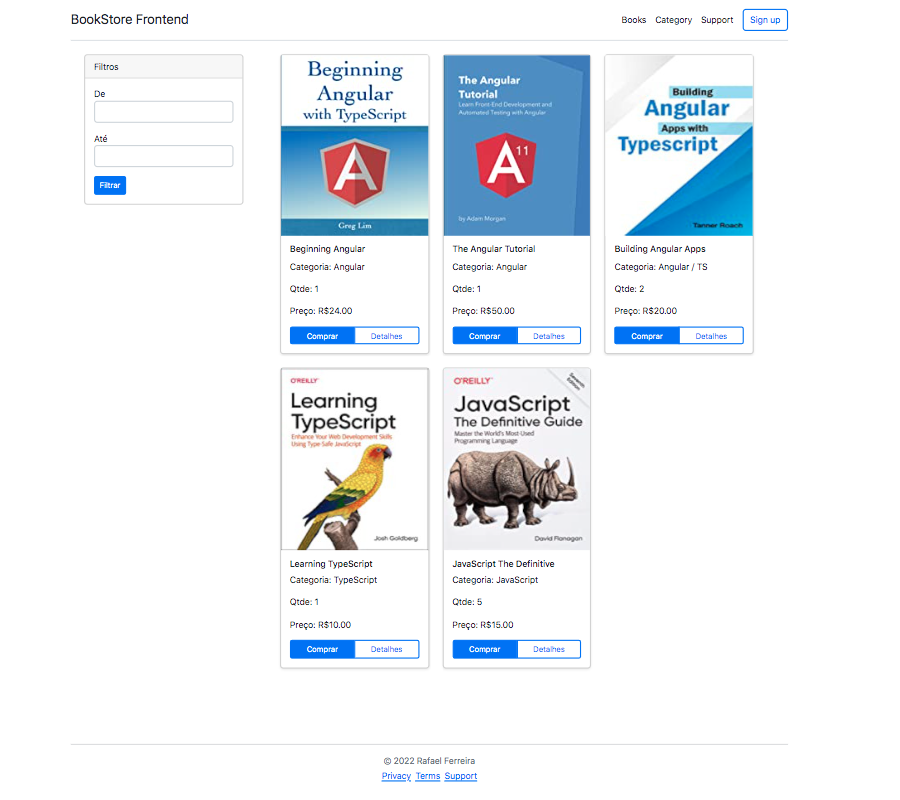

# Desafio de Projeto - Como criar um front-end de um e-commerce utilizando Angular

Projeto desenvolvido para o **Desafio de Projeto - Como criar um front-end de um e-commerce utilizando Angular** realizado no curso da [Digital Innovation One - DIO](https://www.dio.me/).

## Sobre o projeto

Neste projeto foi desenvolvido uma tela de e-commerce de livros, estruturando nosso projeto back-end e criando a nossa API de listagem de produtos.

Foi utilizado o módulo In-memory Web API para realizar request e response utilizando HttpClient.

Este projeto foi gerado com [Angular CLI](https://github.com/angular/angular-cli) versão 14.1.0.

## Screen

## Tecnologias

- `Angular 14.1.0.`
- `JavaScript`
- `TypeScript`
- `Git`

### Referências

- [Como criar um front-end de um e-commerce utilizando Angular](https://web.dio.me/lab/desenvolvimento-de-testes-unitarios-para-validar-uma-api-rest-de-gerenciamento-estoques-de-cerveja/learning/df366920-d30b-482c-9263-df3eab2c8691)

### Informações pessoais:

- Linkedin: [https://www.linkedin.com/in/rafael-m-ferreira/](https://www.linkedin.com/in/rafael-m-ferreira/)
